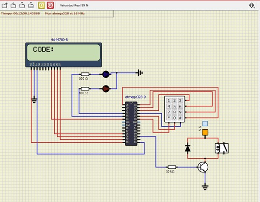
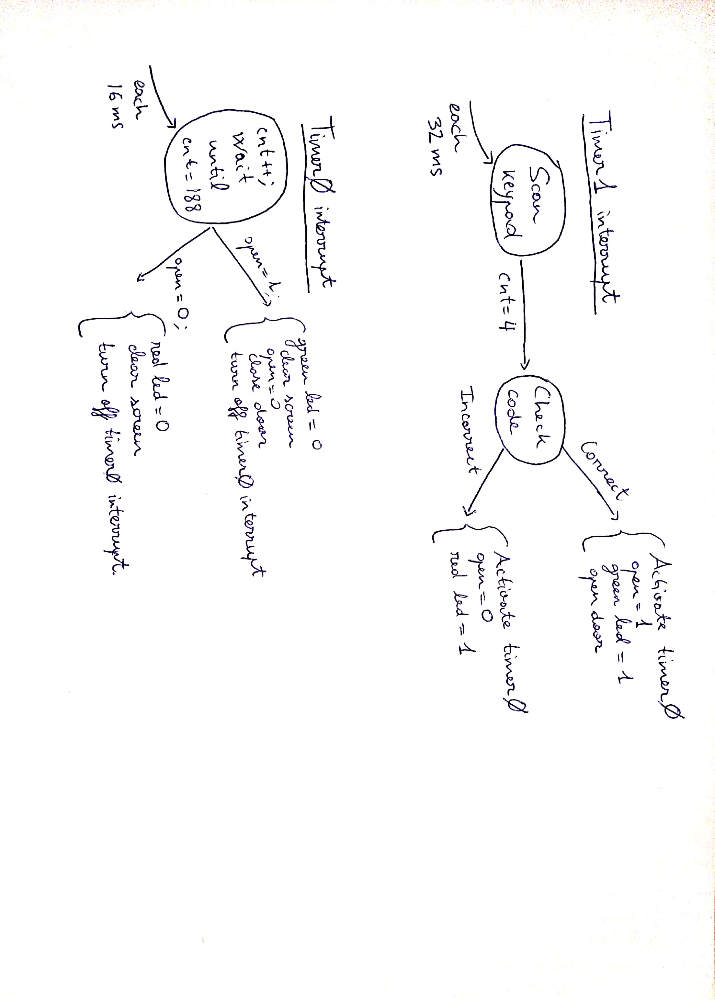
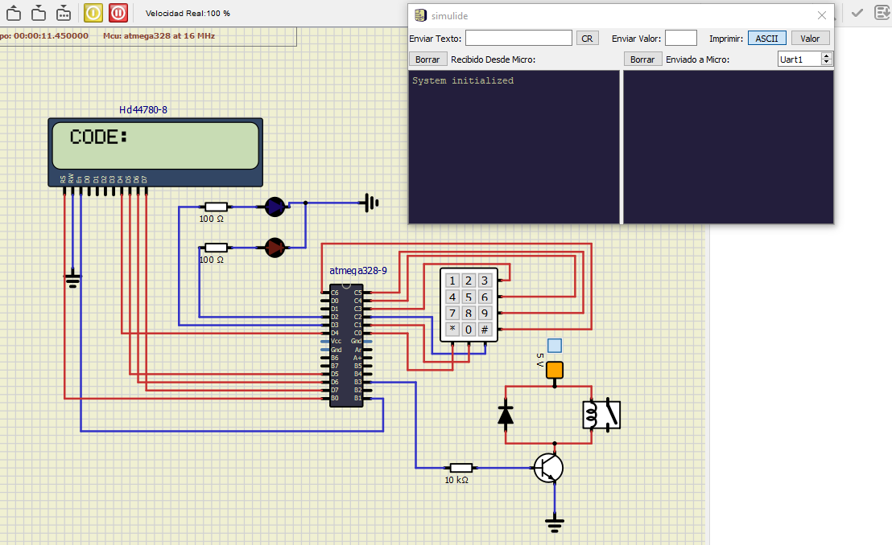
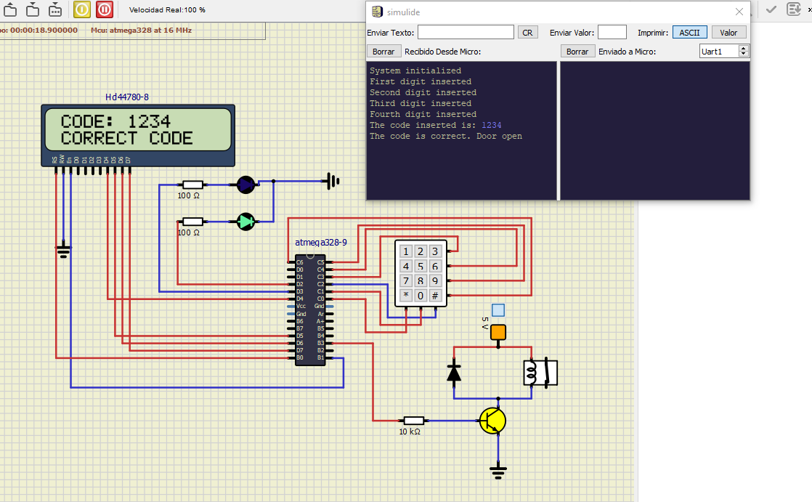
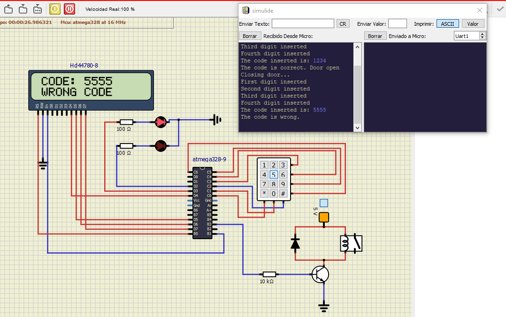

# Description of 4x3 keyboard control
## Team members

Enol Ayo Sando and Marina Balbín Salas

[Proyect Link](https://github.com/EnolAyo/Digital_Electronics_2/tree/master/Labs/08-project/project/project)

## Project objectives
The aim of this proyect is to develop an application which opens a door through a 4x3 keyboard. A 4 digit-code will be inserted and will activate the relay that will open the door. The time to insert this code will be limited and there will be 3 different correct codes to achieve this.There will be a green led illuminated while the door is open and a red led illuminated when the wrong code is inserted. Important information about the state of the system will be sent with UART.

## Hardware description


-PIN PC0 TO PC5 ARE USED TO CONTROL THE KEYBOARD (PC0 to PC2 used as outputs/PC3 to PC6 as inputs). The keypad works as a matrix of switches. When one key is pressed its switch is closed, and therefore corresponding row pin and column key are connected. 

-PIN PB3 TO THE RELAY (used as output).This pin is connected to a resistor and a transistor that is used as an switch. When the output is one the switch is openned and the relay too. There is also a diode in parallel with the relay to protect it.

-PIN PD2 and PD3 used as outputs to connect the LEDs.These are connected in active high.

-PIN PD4,PD5,PD6 PD7,PB0 and PB1 are used to control the LCD display.It will be used for showing the code and also to show if the code is correct or not. 

## Code description and simulations
### Flowchart


### KEYPAD.C
In this library we have define the following functions:
```
I.	uint8_t code_analyzer(uint8_t code[4],uint8_t correct_code1[4],uint8_t correct_code2[4],uint8_t correct_code3[4])
```
Used for figuring out if the inserted code is correct or not. The inputs of this function are the code introduced by the user and the 3 correct codes. The output is '1' if the code matches with a correct code and '0' if not.
For this, we declare 3 counters (one for each code). We compare each position of the codes and if they are equal the counter is increased. If the value of counters is 4 it means that the code is correct. If the counter is different from 4, that would mean that the code is incorrect.

```
II	char read_digits(void)
```
Used for scanning the keypad and relating each key to it’s decimal number .

The process to scan a keyboard matrix 4x3 is the next:

4 pins are defined as inputs, in our case PC6–PC3, and they correspond to the rows of the keypad. The other 3 pins operate as outputs from microcontroller, in our case PC2-PC0, and they are connected to the column pins in the keypad. When the function is called, we write in the output pins this sequence:
				011 - 101  - 110 
The input pins are checked after each output value. 
Is known that one key has been pressed if any input bit is equal to zero. Knowing the position of the '0' in the output and the input we get the switch location.
For example, we define 


        GPIO_write_low(&PORTC,0);
	GPIO_write_high(&PORTC,1);
	GPIO_write_high(&PORTC,2);


It would be the 011 output, and then we decode looking the binary combinations, for example:

```
if(GPIO_read(&PINC,3)==0){
		_delay_ms(10);
		while(GPIO_read(&PINC,3)==0);
		return '1';

```

If the key which corresponds to 1 is pressed, since we would get as input a '0' in the PIN that corresponds with the firs row (PC3). Therefore we would run the code inside the "if". First we delay 10 ms to avoid debouncing and then we wait with a while loop until the key is not pressed anymore. Finally we return the value.
If none key is pressed, this function would return a 'X' char.

### LECTURE LIBRARIES

We use several libraries given at class:

   o    gpio.c -To define the inputs and the outputs of the microcontroller
   
   o 	uart.c – To send information about the state of the system though the uart port.
   
   o	lcd.c- To show the digits on the screen.
   
   o	timer.c – To scan the keypad and control the times, such as the limit time to introduce the code or opening/closing time of the door.
     
     

### MAIN.C

-Before main.c, we declare to global variables. One is open, and it indicates if the door is open with a '1'. The other variable is called wait_clear, and we use it in order not to accept a new code until the screen is cleared. Then inside main we set of the input/outputs of the microcontroller: LEDs, relay, keyboard. We also configure the LCD display, the UART and the timers. We set TIMER1 with a 33 ms overflow and TIMER0 with a 16 ms overflow. The interrupt subroutine of the first timer will be used for scanning the keypad, and TIMER0 interrupt will be used mainly to close the door and other things that we will explan later.
```
//Global variables: used by both interrupt routines
uint8_t open=0;//The door is open (1) or closed (0)
uint8_t wait_clear=0;//Indicates if we have to wait until screen cleared

int main(void)
{	//Configure LEDs
	GPIO_config_output(&DDRD,LED_GREEN);
	GPIO_write_low(&PORTD,LED_GREEN); //ACTIVE HIGH
	
	GPIO_config_output(&DDRD,LED_RED);
	GPIO_write_low(&PORTD,LED_RED); //ACTIVE HIGH
	
	//Configure LCD display
	lcd_init(LCD_DISP_ON);
	lcd_gotoxy(1,0);
	lcd_puts("CODE: ");
	
	//Configure keypad ports
	GPIO_config_output(&DDRC,0);
	GPIO_config_output(&DDRC,1);
	GPIO_config_output(&DDRC,2);
	GPIO_config_input_pullup(&DDRC,3);
	GPIO_config_input_pullup(&DDRC,4);
	GPIO_config_input_pullup(&DDRC,5);
	GPIO_config_input_pullup(&DDRC,6);
	
	//Configure relay
	GPIO_config_output(&DDRB,3);
	
	//Timer1 for scanning keypad
	TIM1_overflow_33ms();//scan every 33 ms
	TIM1_overflow_interrupt_enable();
	//Timer0 for closing door
	TIM0_overflow_16ms();
	
	//Set interrupts
	sei();
	
	//Configure UART
	
	uart_init(UART_BAUD_SELECT(9600,F_CPU))	;
	uart_puts("System initialized\r\n");
   
    while (1);//forever loop
    
}


```

### ISR(TIMER1_OVF_vect)- INTERRUPTION N1
This interruption routine is used to scan the keypad each 33 ms.
The variables that we are going to use for this are the following: First we have 3 strings for the correct codes. Then we have 'cnt', which controls what is position of the digit that the user is introducing. We also have 'time_limit_cnt' and 'time_limit_on'. The first one counts the number of times that the routine was called and the second one indicates if the time limit for introducing the code is active. Finally we have the string 'code' for storing the code and the char 'readed' for reading the keypad.	
```
//Declaration of 3 correct codes
	static char correct_code1[4]={'1','2','3','4'};
	static char correct_code2[4]={'5','6','7','8'};
	static char correct_code3[4]={'6','3','8','7'};
	static uint8_t cnt=0;//Count the number of digits entered
	static uint8_t time_limit_on=0;//Time limit goes on when first digit is pressed
	static uint16_t time_limit_cnt=0;//Count the time to enter the code (16 s approx.)
	static char code[4]={'X','X','X','X'};//Code entered
	char readed=read_digits();//If none button is pressed the output is 'X'
```

When we have readed the keypad, we only have to store the char if it is not 'X' (code for none button pressed) and if the screen is cleared from the previous code (wait_clear).
If cnt==1 that means that is the first digit of the code, so we activate the time limit and set time_limit_cnt to zero. IF cnt==4 the code has been completely introduced so that we can turn off the time limit and set wait_clear to '1'. Until this global variable is '0' and the screen cleared, we will not accept another code. Finally we enable TIMER0 interrupt.
Then we have to check if the code is correct with the 'code_analyzer' function. If the code is correct, the door is opened and the green LED turns on until it is closed. The global variable open is set to '1'. On the other hand, if the code is incorrect, we set open as '0' and turn on the red LED.

```
if((readed!='X')&&(wait_clear==0)){//We accept the digit only if the screen is cleared from the previous code
		switch(cnt){
			case 0:
				uart_puts("First digit inserted\r\n");
				break;
			case 1:
				uart_puts("Second digit inserted\r\n");
				break;
			case 2:
				uart_puts("Third digit inserted\r\n");
				break;
			case 3:
				uart_puts("Fourth digit inserted\r\n");
				break;
			default:
				break;
		}
		
		code[cnt]=readed;
		lcd_gotoxy(cnt+7,0);
		lcd_putc(readed);
		cnt++;
		if(cnt==1){
			time_limit_cnt=0;//Set time 
			time_limit_on=1;//Activation of time limit
		}
		if(cnt==4){
			cnt=0;
			uart_puts("The code inserted is: ");
			uart_putc(code[0]);uart_putc(code[1]);uart_putc(code[2]);uart_putc(code[3]);
			uart_puts("\r\n");
			wait_clear=1;//Wait until the screen is cleared
			time_limit_on=0;//Time limit off
			TIM0_overflow_interrupt_enable();//Start counting to close the door
			if(code_analyzer(code,correct_code1,correct_code2,correct_code3)==1){
				uart_puts("The code is correct. Door open");
				open=1;//door open
				GPIO_write_high(&PORTB,3);//open door
				GPIO_write_high(&PORTD,LED_GREEN);
				GPIO_write_low(&PORTD,LED_RED);
				lcd_gotoxy(1,1);
				lcd_puts("CORRECT CODE");
				
				
			}
			else
			{	
				uart_puts("The code is wrong.");
				open=0;//door closed
				lcd_gotoxy(1,1);
				lcd_puts("WRONG CODE");
				GPIO_write_high(&PORTD,LED_RED);
				GPIO_write_low(&PORTD,LED_GREEN);
			}
			uart_puts("\r\n");
		}
	}

```

In the moment that the first digit is read, time limit to introduce the code will start to increase on each interrupt routine execution. We defined a time limit of 500 cycles of 32 ms, which is around 16 seconds. When time_limit_cnt==500 and time_limit_on==1 the time to introduce the code is over, so we clear the code from the screen and set cnt to '0' so that the next digit readed will be the first of the code.


```
time_limit_cnt++;
	if((time_limit_cnt==500)&&(time_limit_on==1)){
		time_limit_cnt=0;
		cnt=0;
		lcd_gotoxy(7,0);
		lcd_puts("    ");
		uart_puts("Time for introducing code exceeded. \r\n");
	}
}
```


### ISR(TIMER0_OVF_vect)
This interruption subroutine is mainly used to close the door, but it also has other functions. Since the door must remain open for 3 seconds and the overflow is 16 ms, we need that the routine is executed 188 times before doing anything. We count this with 'cnt', and we put it to 0 when its value is 188.
Then, if the global variable open is equal to '1', we have to close the door and turn off the green led. We set open to 0. If open was equal to 0, we only turn off the red LED.
Finally, we clear the screen, disable the interrupt and set wait_clear to 0, so that a new code could be introduced.

```
ISR(TIMER0_OVF_vect){
	//Interrupt used to close the relay
	static uint8_t cnt=0;
	if(cnt==188){
		cnt=0;
		if(open==1){
			GPIO_write_low(&PORTB,3);//close door
			GPIO_write_low(&PORTD,LED_GREEN);
			open=0;
			uart_puts("Closing door...\r\n");
		}
		else{//if the door is closed we clear the screen for a new code
			GPIO_write_low(&PORTD,LED_RED);
		}
		TIM0_overflow_interrupt_disable();
		lcd_gotoxy(7,0);
		lcd_puts("    ");//Clear screen
		lcd_gotoxy(1,1);
		lcd_puts("            ");
		wait_clear=0;//the screen is cleared now
			
	}
	cnt++;
	
}
```

## Video/Animation
[Video Link](https://www.youtube.com/watch?v=WDP6Cb1VhOc&feature=youtu.be)

## Discussion of results
We are satisfied with our project results. All the goals were achieved.
We struggle at the beginning trying to scan the keyboard matrix. We finally realized that we had to do this with a TIMER and an interruption, not in the main.c.
Other difficulty was the UART integration. We saw that it gets blocked because all the data information did not fit in the transmission buffer. We increased the size of the transmission buffer in uart.h. 
We have tried to make the system the most robust that we could. For example, we do not accept a new code until the previous one is removed from the screen. We have tested the circuit writing many different codes fast and the results are always satisfactory. 
It was an interesting project which help us to integrate al the laboratories classes together.

This picture shows when the system is initialyzed


This picture shows when the right code is inserted


This picture shows when the wrong code is inserted



## References
1-Class lectures such as the PDFs lectures and notes.

2-(https://aticleworld.com/matrix-keypad-interfacing-with-pic-microcontroller/)

3-(http://simulide.blogspot.com/p/blog-page_15.html)

4-(https://electrosome.com/interfacing-relay-with-pic-microcontroller/#:~:text=A%20relay%20can%20be%20easily,current%20flows%20through%20the%20relay.)
