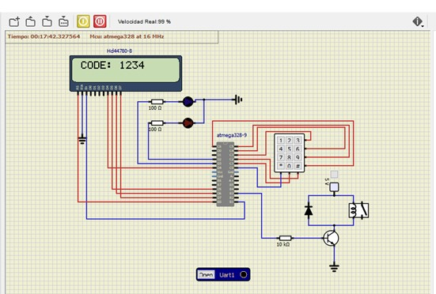

# Description of 4x3 keyboard control
## Team members

Enol Ayo Sando and Marina Balbín Salas

[Proyect Link](https://choosealicense.com/licenses/mit/)

## Project objectives
The aim of this proyect is to develop an application which could open a door through a 4x3 keyboard. A 4 digit-code will be inserted and will activate the relay that will open the door. The time to insert this code will be limited and there’ll be 3 different correct codes to archieve this.If the inserted code is correct a green led will be active,if is not,a red one.

## Hardware description
Write you text here



## Code description and simulations
### KEYPAD.C
In this library we have define the following functions:

```
I.	uint8_t code_analyzer(uint8_t code[4],uint8_t correct_code1[4],uint8_t correct_code2[4],uint8_t correct_code3[4])
```
Used to figuring out if the inserted code is correct or not.

```
II	char read_digits(volatile uint8_t *reg_name)
```
Used to relate each key to it’s decimal number .
The process to scan a keyboard matrix 4x3 is the next:

4 pins are defined as inputs ,in our case PC6–PC3  and 3 pins operates as outputs from microcontroller,in our case PC2-PC0.The output of 3 values is repeated the hole time
011 - 101  - 110 .The input pins are checked after each output value. 
Is known that one key has been pressed if any input bit is equal to zero. Knowing the output and input binary combinations we get the switch location.
For example, we define 

```
        GPIO_write_low(&PORTC,0);
	GPIO_write_high(&PORTC,1);
	GPIO_write_high(&PORTC,2);

```
It would be the 011 output, and then we decode looking the binary combinations, for example:

```
if(GPIO_read(&PINC,3)==0){
		_delay_ms(10);
		while(GPIO_read(&PINC,3)==0);
		return '1';


```
The key keyboard which corresponds to 1 is pressed, because we have a 0 at the input at the position [1,1]

### LECTURE LIBRARIES

We use several libraries used in class:
o	gpio.c -To define the inputs and the outputs of the microcontroller
o	uart.c – To send information about the state of the system though the uart port
o	lcd.c- To show the digits thought the screen.
o	timer.c – To control the times, such as the limit time to introduce the code or opening/closing time of the door.

### MAIN.C

-Set of the input/outputs of the microcontroller. We use PORTC for the keyboard and PORTB for the relay
PONGO AQUI TODO EL CODIGO??
-Timer 1 set with a 33 ms overflow (auqi me falta algo,preguntar a enol) (as used in Laboratories class)
-Definition of the valid codes (3 in our case)

-ISR(TIMER1_OVF_vect)- INTERRUPTION N1
In this interruption ,the introduced code is readed with the function 

```
read_digits(&PINC).
```
Firstly, we have a control character (control='X'). In the moment that character is different from X we will star to read the code.

```
static uint8_t cnt=0;
	static uint8_t time_limit_on=0;
	static uint16_t time_limit=0;
	char code[4];
	char readed=read_digits(&PINC);
	if(readed!='X'){
		code[cnt]=readed;
		lcd_gotoxy(cnt+1,0);
		lcd_putc(readed);
		cnt++;
		
		if(cnt==1){
			time_limit=0;
			time_limit_on=1;
		}
		if(cnt==4){
			time_limit_on=0;
		}
	}
	
	if(cnt==4){ 
		cnt=0;
	}

```

In the moment that a digit is read, time limit will star to increase. It starts and is switch on also(time_limit=0  time_limit_on=1). We defined a time limit of 250 cycles of 32 ms and we add 1 to time_limit variable. When we archive this condition and also we have the time_limit on,we will reboot our time_limit variable to 0 again because time is over.


```
time_limit++;
	if((time_limit==250)&&(time_limit_on==1)){
		time_limit=0;
		cnt=0;
		lcd_gotoxy(1,0);
		lcd_puts("    ");
	}
    
```
In the moment that we have the 4 digits of our code in the suitable time, the limit time will be switch off. (time_limit_on=0)

### SECOND INTERRUPTION
0,0016sx3s=188cycles
We want the door to be open 3 seconds. The maximum value of the timer is 16ms so to get our goal we need to multiplie and we will get 188 cycles.
We use TIMER 0

## Video/Animation
Write your text here.

## References
1-Class lectures such as the PP’lecture and notes.

2-La pagina web que miro Enol


